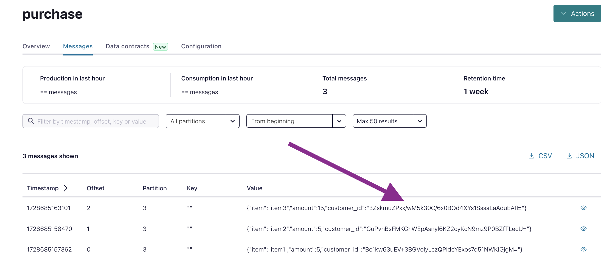

### Notes

1. Make sure to use Stream Governance [Advanced package](https://docs.confluent.io/cloud/current/stream-governance/packages.html#packages) and create a Kafka topic called "purchase" before running this example.
2. Apply this Terraform configuration by following the [Sample Project for Confluent Terraform Provider](https://registry.terraform.io/providers/confluentinc/confluent/latest/docs/guides/sample-project).
3. Download the [Confluent Platform archive package](https://docs.confluent.io/platform/current/installation/installing_cp/zip-tar.html) that contains `confluent-7.7.1/bin/kafka-avro-console-producer` and `confluent-7.7.1/bin/kafka-avro-console-consumer` binaries.
4. Update the `field-level-encryption-schema/config.properties` file to include the relevant Kafka cluster details (bootstrap server, Kafka API key, and Kafka API secret) and copy it to the `confluent-7.7.1` folder.
5. Open the `confluent-7.7.1` directory and run the following command to produce encrypted field messages to the Kafka topic called "purchase":
    ```bash
    # /Users/alex/work/confluent-7.7.1
    $ ./bin/kafka-avro-console-producer \
      --topic purchase \
      --property schema.registry.url=${SR_REST_ENDPOINT} \
      --property value.schema="$(< /Users/alex/work/terraform-provider-confluent/examples/configurations/field-level-encryption-schema/schemas/avro/purchase.avsc)"  \
      --property basic.auth.credentials.source=USER_INFO  \
      --property basic.auth.user.info=${SR_API_KEY}:${SR_API_SECRET} \
      --bootstrap-server ${KAFKA_BOOTSTRAP_SERVER} \
      --producer.config config.properties
    ```
    Your output should resemble the following:
    ```bash
    # /Users/alex/work/confluent-7.7.1
    ➜  confluent-7.7.1 ./bin/kafka-avro-console-producer \
      --topic purchase \
      --property schema.registry.url=${SR_REST_ENDPOINT} \
      --property value.schema="$(< /Users/alex/work/terraform-provider-confluent/examples/configurations/field-level-encryption-schema/schemas/avro/purchase.avsc)"  \
      --property basic.auth.credentials.source=USER_INFO  \
      --property basic.auth.user.info=${SR_API_KEY}:${SR_API_SECRET} \
      --bootstrap-server ${KAFKA_BOOTSTRAP_SERVER} \
      --producer.config config.properties
    [2024-10-10 10:50:08,122] INFO KafkaAvroSerializerConfig values:
        auto.register.schemas = true
        avro.reflection.allow.null = false
        avro.remove.java.properties = false
        ...
        value.subject.name.strategy = class io.confluent.kafka.serializers.subject.TopicNameStrategy
     (io.confluent.kafka.serializers.KafkaAvroSerializerConfig:375)
    {"item": "item1", "amount": 5.0, "customer_id": "id12"}
    [2024-10-10 10:50:41,702] INFO Registered dek for kek kek-name, subject purchase-value (io.confluent.kafka.schemaregistry.encryption.FieldEncryptionExecutor:463)
    {"item": "item2", "amount": 5.0, "customer_id": "id13"}
    {"item": "item3", "amount": 15.0, "customer_id": "id14"}
    ```
   
    And we check the encrypted field messages on the Confluent Cloud Console:

    

6. Run the following command to consume encrypted events from the Kafka topic called "purchase":
    ```bash
    # /Users/alex/work/confluent-7.7.1
    $ export AWS_ACCESS_KEY_ID=<REDACTED>
    $ export AWS_SECRET_ACCESS_KEY=<REDACTED>
    
    $ ./bin/kafka-avro-console-consumer \
      --topic purchase \
      --property schema.registry.url=${SR_REST_ENDPOINT} \
      --property value.schema.id=${SCHEMA_ID}  \
      --property basic.auth.credentials.source=USER_INFO  \
      --property basic.auth.user.info=${SR_API_KEY}:${SR_API_SECRET} \
      --bootstrap-server ${KAFKA_BOOTSTRAP_SERVER} \
      --consumer.config config.properties \
      --from-beginning
    ```

   SCHEMA_ID is the value of the `confluent_schema.purchase.schema_identifier` attribute (for example, 100004), which can be obtained from either the Terraform state file or the Confluent Cloud Console/CLI.
   See [How do you find schema IDs?](https://docs.confluent.io/cloud/current/sr/faqs-cc.html#faq-print-schemas-ids) for details.
   Your output should resemble the following:
    ```bash
    # /Users/alex/work/confluent-7.7.1
    ➜  confluent-7.7.1 ./bin/kafka-avro-console-consumer \
      --topic purchase \
      --property schema.registry.url=${SR_REST_ENDPOINT} \
      --property value.schema.id=${SCHEMA_ID}  \
      --property basic.auth.credentials.source=USER_INFO  \
      --property basic.auth.user.info=${SR_API_KEY}:${SR_API_SECRET} \
      --bootstrap-server ${KAFKA_BOOTSTRAP_SERVER} \
      --consumer.config config.properties \
      --from-beginning
    [2024-10-10 11:02:23,135] INFO KafkaAvroDeserializerConfig values:
        auto.register.schemas = true
        avro.reflection.allow.null = false
        avro.use.logical.type.converters = false
        ...
        value.subject.name.strategy = class io.confluent.kafka.serializers.subject.TopicNameStrategy
     (io.confluent.kafka.serializers.KafkaAvroDeserializerConfig:375)
    {"item":"item1","amount":5.0,"customer_id":"id12"}
    {"item":"item2","amount":5.0,"customer_id":"id13"}
    {"item":"item3","amount":15.0,"customer_id":"id14"}
    ```
7. See the following docs for more details:
    * [Client-Side Field Level Encryption (CSFLE) with AWS KMS](https://github.com/pneff93/csfle/blob/main/aws/README.md).

    * [Hands On: Configure, Build and Register Protobuf and Avro Schemas](https://developer.confluent.io/learn-kafka/schema-registry/configure-schemas-hands-on/).

    * [Integrating Schema Registry with Client Applications](https://developer.confluent.io/learn-kafka/schema-registry/integrate-schema-registry-with-clients/).
